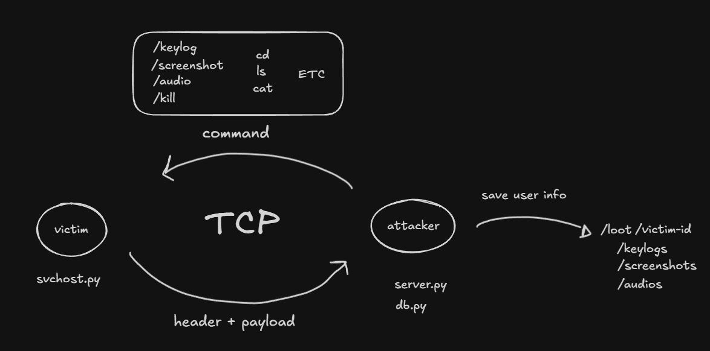

# kast-c2

> ⚠️ **Educational purposes only.** This project was built to study offensive security concepts — C2 architecture, socket communication, persistence mechanisms, and data exfiltration techniques. Do not use against systems you do not own or have explicit permission to test. The author takes no responsibility for misuse.

---

A Python-based Remote Access Trojan with a C2 (Command & Control) infrastructure, built as a cybersecurity learning project. This is a work in progress.

## Motivation

Understanding how offensive tools work is fundamental to defending against them. This project was built to study:

- How RATs establish and maintain connections to a C2 server
- How data is exfiltrated over raw sockets
- How malware persists across reboots via the Windows registry
- How a C2 server manages multiple victims and logs activity

## Architecture



The project has two sides:

**Client (`svchost.py`)** — runs on the victim machine. Connects back to the C2 server, collects system information, and waits for commands.

**Server (`server.py`)** — runs on the attacker machine. Accepts incoming connections, stores victim data in SQLite, and dispatches commands.

## Protocol

All communication uses a structured binary protocol:

```
TYPE|LENGTH|EXTRA\n
[LENGTH bytes of payload]
```

- `TYPE` — packet type (`TEXT`, `PNG`, `WAV`, `TMP`, `CWD`)
- `LENGTH` — payload size in bytes
- `EXTRA` — filename or path (for files), `none` for text

## Features

### Implemented
- [x] TCP socket-based C2 connection
- [x] Structured binary protocol (`TYPE|LENGTH|EXTRA\n`)
- [x] System info collection (hostname, IP, OS, platform)
- [x] Windows registry persistence
- [x] Self-copy to `AppData` before registry entry
- [x] Screenshot capture and exfiltration
- [x] Keylogger (runs in parallel thread, dumps to hidden file)
- [x] Audio recording and exfiltration
- [x] Shell command execution with directory state (`cd` updates prompt)
- [x] Self-destruction
- [x] C2 server with SQLite victim persistence

### In progress
- [ ] Command whitelist (security hardening)
- [ ] Checksum validation (protocol integrity)
- [ ] Reconnection jitter and exponential backoff
- [ ] File download command
- [ ] Multiple victim management

## Building

### Linux/Mac
```bash
chmod +x scripts/build.sh
./scripts/build.sh
```

### Windows
```powershell
powershell -ExecutionPolicy Bypass -File scripts/build.ps1
```

Binaries will be in `dist/`:
- `svchost` — RAT client (run on victim)
- `server` — C2 server (run on attacker)

## Project Structure

```
kast-c2/
├── scripts/
│   ├── build.sh         # Linux/Mac build script
│   └── build.ps1        # Windows build script
├── docs/
│   └── diagram.png      # Architecture diagram
├── svchost.py           # RAT client (victim side)
├── server.py            # C2 server (attacker side)
├── db.py                # SQLite helpers
├── requirements.txt     # Python dependencies
├── LICENSE
└── README.md
```

## Environment

Tested on Windows. Developed and studied in a controlled local lab using Docker with isolated networks.

---

*Part of a personal cybersecurity studies portfolio.*